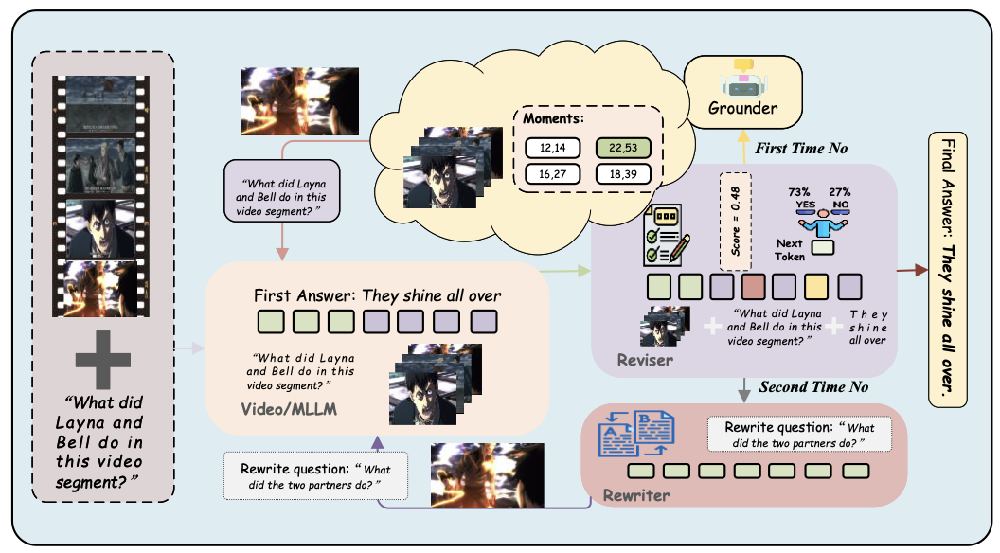

<h1 align="center">MVRR: A Multi-Agent Framework for VideoQA with Reviser and Rewriter Synergy</h1>


<!-- <p align="center">
  <a href="https://yeliu.dev/" target="_blank">Ye Liu</a><sup>1&dagger;</sup>, <a href="https://qhlin.me/" target="_blank">Kevin Qinghong Lin</a><sup>2&dagger;</sup>, <a href="https://web.comp.polyu.edu.hk/chencw/" target="_blank">Chang Wen Chen</a><sup>1</sup>, <a href="https://sites.google.com/view/showlab" target="_blank">Mike Zheng Shou</a><sup>2</sup>
  <p align="center"><sup>1</sup>The Hong Kong Polytechnic University <sup>2</sup>Show Lab, National University of Singapore</p>
</p> -->

<!--
> **TL;DR:** Pioneer DeepSearch-like Video Understanding.
-->

**MVRR** is a multi-modal agent framework that enhances videoQA accuracy by emulating *human-like* processes, such as *localizing* and *verifying* moments, *synthesizing answers*, *checking initial answers*, *rewrite questions* and *secondary answering*. This approach addresses the unique challenges of VideoQA in a progressive strategy.

<p align="center"></p>

<!--
## 🔥 News

- **`2025.04.05`** 📊 See [BENCHMARK.md](/docs/BENCHMARK.md) for evaluation results of MVRR on public benchmarks.
- **`2025.03.28`** 🚀 VideoMind-2B is ready on [Hugging Face Spaces](https://huggingface.co/spaces/yeliudev/VideoMind-2B). Check it out!
- **`2025.03.21`** ⭐️ Code, model, and dataset release.
- **`2025.03.17`** 🎉 Our [tech report](https://arxiv.org/abs/2503.13444) is available online.
-->

## 🏆 MVRR on Public Benchmarks

| Benchmark                         | Evaluation Results (2B/7B)                                      |
|-----------------------------------|-----------------------------------------------------------------|
|      CG-Bench (mini)              | `long-acc: 31.9`                                                |
|      Video-MME (w/o subs)         | `Long: 46.6`                                                    |
|      LongVideoBench               | `Acc: 51.4`                                                     |

See [BENCHMARK.md](/docs/BENCHMARK.md) for full evaluation results.

<!--
## 🕹️ Gradio Demo

https://github.com/user-attachments/assets/a4d99c05-aa73-4ed9-a275-2362a201bfec

Play with our [online demo](https://huggingface.co/spaces/yeliudev/VideoMind-2B) or see [DEMO.md](/docs/DEMO.md) for guidelines about how to deploy it locally.
-->

<!--
## 📦 VideoMind-SFT Dataset

We provide raw videos, compressed videos, and pre-processed annotations of **27 video grounding / QA datasets**, including our **VideoMind-SFT** (481K) for training and multiple benchmarks for evaluation. We also release the datasets used during our early exploration (but not included in the final version) to facilitate future research.

The list of source datasets is shown below. See our [dataset repo](https://huggingface.co/datasets/yeliudev/VideoMind-Dataset) for more details.

#### Grounder (210K):

| Dataset | Source | Processed (Recommended) |
|-|:-:|:-:|
| QVHighlights | [Link](https://github.com/jayleicn/moment_detr) | [`qvhighlights`](https://huggingface.co/datasets/yeliudev/VideoMind-Dataset/tree/main/qvhighlights) |
| DiDeMo | [Link](https://github.com/LisaAnne/LocalizingMoments/) | [`didemo`](https://huggingface.co/datasets/yeliudev/VideoMind-Dataset/tree/main/didemo) |
| TACoS | [Link](https://www.mpi-inf.mpg.de/departments/computer-vision-and-machine-learning/research/vision-and-language/tacos-multi-level-corpus) | [`tacos`](https://huggingface.co/datasets/yeliudev/VideoMind-Dataset/tree/main/tacos) |
| QuerYD | [Link](https://www.robots.ox.ac.uk/~vgg/data/queryd/) | [`queryd`](https://huggingface.co/datasets/yeliudev/VideoMind-Dataset/tree/main/queryd) |
| HiREST (Grounding) | [Link](https://github.com/j-min/HiREST) | [`hirest`](https://huggingface.co/datasets/yeliudev/VideoMind-Dataset/tree/main/hirest) |
| HiREST (Step Captioning) | [Link](https://github.com/j-min/HiREST) | [`hirest`](https://huggingface.co/datasets/yeliudev/VideoMind-Dataset/tree/main/hirest) |
| CosMo-Cap | [Link](https://github.com/showlab/cosmo) | [`cosmo_cap`](https://huggingface.co/datasets/yeliudev/VideoMind-Dataset/tree/main/cosmo_cap) |
| InternVid-VTime | [Link](https://github.com/OpenGVLab/InternVideo/tree/main/Data/InternVid) | [`internvid_vtime`](https://huggingface.co/datasets/yeliudev/VideoMind-Dataset/tree/main/internvid_vtime) |

#### Verifier (232K):

| Dataset | Source | Processed (Recommended) |
|-|:-:|:-:|
| QVHighlights-Verify | [Link](https://github.com/jayleicn/moment_detr) | [`verifying`](https://huggingface.co/datasets/yeliudev/VideoMind-Dataset/tree/main/verifying), [`qvhighlights`](https://huggingface.co/datasets/yeliudev/VideoMind-Dataset/tree/main/qvhighlights) |
| DiDeMo-Verify | [Link](https://github.com/LisaAnne/LocalizingMoments/) | [`verifying`](https://huggingface.co/datasets/yeliudev/VideoMind-Dataset/tree/main/verifying), [`didemo`](https://huggingface.co/datasets/yeliudev/VideoMind-Dataset/tree/main/didemo) |
| TACoS-Verify | [Link](https://www.mpi-inf.mpg.de/departments/computer-vision-and-machine-learning/research/vision-and-language/tacos-multi-level-corpus) | [`verifying`](https://huggingface.co/datasets/yeliudev/VideoMind-Dataset/tree/main/verifying),[`tacos`](https://huggingface.co/datasets/yeliudev/VideoMind-Dataset/tree/main/tacos) |

#### Planner (39K):

| Dataset | Source | Processed (Recommended) |
|-|:-:|:-:|
| NExT-QA-Plan | [Link](https://github.com/doc-doc/NExT-QA) | [`planning`](https://huggingface.co/datasets/yeliudev/VideoMind-Dataset/tree/main/planning), [`nextqa`](https://huggingface.co/datasets/yeliudev/VideoMind-Dataset/tree/main/nextqa) |
| QVHighlights-Plan | [Link](https://github.com/jayleicn/moment_detr) | [`planning`](https://huggingface.co/datasets/yeliudev/VideoMind-Dataset/tree/main/planning), [`qvhighlights`](https://huggingface.co/datasets/yeliudev/VideoMind-Dataset/tree/main/qvhighlights) |

#### Benchmarks

| Dataset | Task | Source | Processed (Recommended) |
|-|:-:|:-:|:-:|
| CG-Bench | Grounded VideoQA | [Link](https://huggingface.co/datasets/CG-Bench/CG-Bench) | [`cgbench`](https://huggingface.co/datasets/yeliudev/VideoMind-Dataset/tree/main/cgbench) |
| ReXTime | Grounded VideoQA | [Link](https://github.com/ReXTime/ReXTime) | [`rextime`](https://huggingface.co/datasets/yeliudev/VideoMind-Dataset/tree/main/rextime), [`activitynet`](https://huggingface.co/datasets/yeliudev/VideoMind-Dataset/tree/main/activitynet), [`qvhighlights`](https://huggingface.co/datasets/yeliudev/VideoMind-Dataset/tree/main/qvhighlights) |
| NExT-GQA | Grounded VideoQA | [Link](https://github.com/doc-doc/NExT-GQA) | [`nextgqa`](https://huggingface.co/datasets/yeliudev/VideoMind-Dataset/tree/main/nextgqa) |
| Charades-STA | VTG | [Link](https://github.com/jiyanggao/TALL) | [`charades_sta`](https://huggingface.co/datasets/yeliudev/VideoMind-Dataset/tree/main/charades_sta) |
| ActivityNet-Captions | VTG | [Link](https://cs.stanford.edu/people/ranjaykrishna/densevid/) | [`activitynet_captions`](https://huggingface.co/datasets/yeliudev/VideoMind-Dataset/tree/main/activitynet_captions), [`activitynet`](https://huggingface.co/datasets/yeliudev/VideoMind-Dataset/tree/main/activitynet) |
| QVHighlights | VTG | [Link](https://github.com/jayleicn/moment_detr) | [`qvhighlights`](https://huggingface.co/datasets/yeliudev/VideoMind-Dataset/tree/main/qvhighlights) |
| TACoS | VTG | [Link](https://www.mpi-inf.mpg.de/departments/computer-vision-and-machine-learning/research/vision-and-language/tacos-multi-level-corpus) | [`tacos`](https://huggingface.co/datasets/yeliudev/VideoMind-Dataset/tree/main/tacos) |
| Ego4D-NLQ | VTG | [Link](https://ego4d-data.org/) | [`ego4d_nlq`](https://huggingface.co/datasets/yeliudev/VideoMind-Dataset/tree/main/ego4d_nlq), [`ego4d`](https://huggingface.co/datasets/yeliudev/VideoMind-Dataset/tree/main/ego4d) |
| ActivityNet-RTL | VTG | [Link](https://github.com/NVlabs/LITA) | [`activitynet_rtl`](https://huggingface.co/datasets/yeliudev/VideoMind-Dataset/tree/main/activitynet_rtl), [`activitynet`](https://huggingface.co/datasets/yeliudev/VideoMind-Dataset/tree/main/activitynet) |
| Video-MME | General VideoQA | [Link](https://github.com/BradyFU/Video-MME) | [`videomme`](https://huggingface.co/datasets/yeliudev/VideoMind-Dataset/tree/main/videomme) |
| MLVU | General VideoQA | [Link](https://github.com/JUNJIE99/MLVU) | [`mlvu`](https://huggingface.co/datasets/yeliudev/VideoMind-Dataset/tree/main/mlvu) |
| LVBench | General VideoQA | [Link](https://github.com/THUDM/LVBench) | [`lvbench`](https://huggingface.co/datasets/yeliudev/VideoMind-Dataset/tree/main/lvbench) |
| MVBench | General VideoQA | [Link](https://github.com/OpenGVLab/Ask-Anything/blob/main/video_chat2/MVBENCH.md) | [`mvbench`](https://huggingface.co/datasets/yeliudev/VideoMind-Dataset/tree/main/mvbench) |
| LongVideoBench | General VideoQA | [Link](https://github.com/longvideobench/LongVideoBench) | [`longvideobench`](https://huggingface.co/datasets/yeliudev/VideoMind-Dataset/tree/main/longvideobench) |

The following datasets are not used in our project (partially used during early exploration), but we still share them to facilitate future research.

| Dataset | Task | Training | Evaluation | Source | Processed (Recommended) |
|-|:-:|:-:|:-:|:-:|:-:|
| QaEgo4D | Grounded VideoQA | ✅ | ✅ | [Link](https://github.com/lbaermann/qaego4d) | [`qa_ego4d`](https://huggingface.co/datasets/yeliudev/VideoMind-Dataset/tree/main/qa_ego4d), [`ego4d`](https://huggingface.co/datasets/yeliudev/VideoMind-Dataset/tree/main/ego4d) |
| Ego4D-NaQ | VTG | ✅ | ✅ | [Link](https://github.com/srama2512/NaQ) | [`ego4d_naq`](https://huggingface.co/datasets/yeliudev/VideoMind-Dataset/tree/main/ego4d_naq), [`ego4d`](https://huggingface.co/datasets/yeliudev/VideoMind-Dataset/tree/main/ego4d) |
| Ego-TimeQA | VTG | ✅ | ❌ | [Link](https://github.com/Becomebright/GroundVQA) | [`ego_timeqa`](https://huggingface.co/datasets/yeliudev/VideoMind-Dataset/tree/main/ego_timeqa), [`ego4d`](https://huggingface.co/datasets/yeliudev/VideoMind-Dataset/tree/main/ego4d) |
| Vid-Morp | VTG | ✅ | ❌ | [Link](https://github.com/baopj/Vid-Morp) | [`vid_morp`](https://huggingface.co/datasets/yeliudev/VideoMind-Dataset/tree/main/vid_morp) |
| VideoXum | VTG (originally VS) | ✅ | ✅ | [Link](https://github.com/jylins/videoxum) | [`videoxum`](https://huggingface.co/datasets/yeliudev/VideoMind-Dataset/tree/main/videoxum) |
| YouCook2 | VTG (originally DVC) | ✅ | ✅ | [Link](http://youcook2.eecs.umich.edu/) | [`youcook2`](https://huggingface.co/datasets/yeliudev/VideoMind-Dataset/tree/main/youcook2) |
| STAR | VideoQA | ✅ | ✅ | [Link](https://bobbywu.com/STAR/) | [`star`](https://huggingface.co/datasets/yeliudev/VideoMind-Dataset/tree/main/star), [`charades_sta`](https://huggingface.co/datasets/yeliudev/VideoMind-Dataset/tree/main/charades_sta) |
| COIN | - | - | - | [Link](https://github.com/coin-dataset/annotations) | [`coin`](https://huggingface.co/datasets/yeliudev/VideoMind-Dataset/tree/main/coin) |
-->

**Notes**:

1. Planner, Grounder, Verifier follows the design of VideoMind (<https://github.com/yeliudev/VideoMind>)
2. Use the following commands to concatenate and extract video tar splits (e.g., videos.tar.gz.00, videos_3fps_480_noaudio.tar.gz.00).

```
# videos.tar.gz.00, videos.tar.gz.01
cat videos.tar.gz.* | tar -zxvf -

# videos_3fps_480_noaudio.tar.gz.00, videos_3fps_480_noaudio.tar.gz.01
cat videos_3fps_480_noaudio.tar.gz.* | tar -zxvf -
```

## 🛠️ Environment Setup
<!--
Our codebase supports training and evaluating on [27 video datasets and benchmarks](https://github.com/yeliudev/VideoMind/blob/main/videomind/dataset/sub_classes) with the following features.

- Flexible hardware settings: NVIDIA GPU / Ascend NPU, Single-Node / Multi-Node
- Efficient training techniques: DeepSpeed ZeRO, BF16, LoRA, SDPA, FlashAttention2, Liger-Kernel
- Customizing the base LLM and conversation templates
- Monitoring the training process via Tensorboard / Wandb
- Group sampling for mixed dataset training
- Multi-process / multi-device evaluation on public benchmarks
-->

See [ENV.md](/docs/ENV.md) for a quick start guide.

## 🔮 Evaluation

See [EVAL.md](/docs/EVAL.md) for details about evaluating MVRR on public benchmarks.

<!--
## 📖 Citation

Please kindly cite our paper if you find this project helpful.

```bibtex
@article{liu2025videomind,
  title={VideoMind: A Chain-of-LoRA Agent for Long Video Reasoning},
  author={Liu, Ye and Lin, Kevin Qinghong and Chen, Chang Wen and Shou, Mike Zheng},
  journal={arXiv preprint arXiv:2503.13444},
  year={2025}
}
```
-->

<!--
[](https://www.star-history.com/#yeliudev/VideoMind&Timeline)
-->
